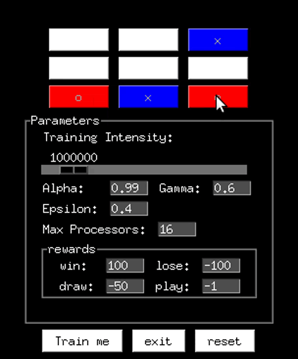

# Q learning based Tic Tac Toe



### Dependancies

* PySimpleGUI
* numpy

### Installation Instructions 

```
pip install numpy 
pip install PySimpleGUI
```
* clone repo 

```
git clone https://github.com/ozayr/Reinforcement_Learning.git
cd Reinforcement_Learning/tictactoe 
python setup.py install
``` 

### Usage Instructions
```
from rl_ticTacToe import run_game

run_game()
```

#### or 

```
cd Reinforcement_Learning/tictactoe/rl_ticTacToe
python gui.py
```
